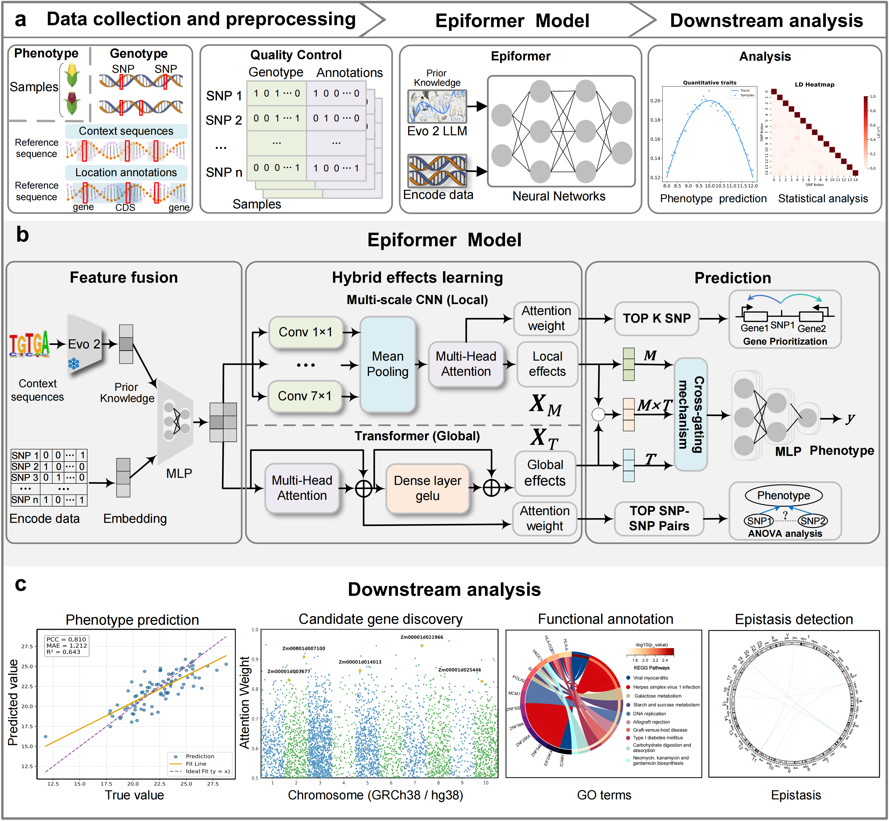

# Epiformer

## English

Epiformer is a PyTorch-based deep learning framework for **epistasis detection** and **phenotype prediction**. It builds an end-to-end regression model (`Epiformer`) by combining:

- Multi-scale CNN + self-attention (`CNN_self_attention`)
- SNP interaction Transformer (`SNPInteractionAttention`)
- Cross-Gated MLP fusion (`CrossGatedMLP`)

### Framework



---

### Project files

- `Epiformer.py`  
  Main training script. Runs 5-fold cross-validation, selects and saves the best model by PCC (Pearson correlation coefficient).

- `attention_weight_singleloci.py`  
  Extracts single-locus attention signals (from the `CNN_self_attention` branch) and exports averaged feature weights.

- `attention_weight_epi.py`  
  Extracts SNP–SNP interaction attention matrices (from the Transformer branch) and exports an averaged attention matrix.

---

### Environment setup

We recommend using conda (the project root provides `environment.yml`):

```bash
# In the project root
conda env create -f environment.yml
conda activate Epiformer
```

Minimal dependencies (for reference): Python 3.9+ and

```bash
pip install torch numpy pandas scikit-learn
```

---

### Data preparation

By default, scripts read data from the following directory (relative to the project root):

`data/data_zeamap/<phe>/`

where `<phe>` is the phenotype name (e.g., `KW`). The directory should contain at least:

- `genotype_encoded.npy`
- `embeddings.pkl`
- `SNP_annotation.csv`
- `yData.csv`

> Dataset download link / DOI: (https://doi.org/10.6084/m9.figshare.30448166)

---

### Outputs (default)

- Training and interpretation outputs are written to:
  - `result/<phe>/`

---

### Train the model

```bash
python Epiformer.py --phe KW
```

`Epiformer.py` supports CLI arguments. If `--data_dir/--result_dir` are not provided, it uses:

- Data dir: `<project_root>/data/data_zeamap/<phe>/`
- Result dir: `<project_root>/result/<phe>/`

#### Training procedure (`Epiformer.py`)

1. Load and concatenate multi-source features (embedding + genotype + SNP annotation).
2. Reduce feature dimension with a small MLP and apply standardization.
3. Train `Epiformer` with 5-fold cross-validation.
4. For each epoch, compute:
   - `Train Loss` (MSE)
   - `Test Loss` (MSE)
   - `PCC`
   - `MAE`
5. If PCC improves for a fold, save the best model:
   - `all_best_model_fold_<k>.pth`
6. Use Early Stopping (default patience=30) based on PCC.

#### Results

- Prints best `PCC / MAE` for each fold
- Prints the final 5-fold average: `Average PCC ± std` and `Average MAE ± std`
- Saves best models (per fold) to:
  - `result/<phe>/all_best_model_fold_<k>.pth`

---

### Extract single-locus attention (single-loci)

```bash
python attention_weight_singleloci.py
```

#### What it does

- Loads a trained model checkpoint (default: fold 1)
- Runs a forward pass and extracts attention-related outputs from `CNN_self_attention`
- Computes averaged feature weights and exports to CSV

#### Default inputs/outputs (current script behavior)

**Important**: `attention_weight_singleloci.py` currently hard-codes the following in `main`:

- `args.phe = "KW/"`
- `args.result_dir = "result/KW"`
- `model_path = "result/KW/all_best_model_fold_1.pth"`

Default output file:

- `result/KW/attention_weights_test_3.csv`

---

### Extract SNP interaction attention (epistasis)

```bash
python attention_weight_epi.py
```

#### What it does

- Loads a trained model checkpoint
- Extracts the attention matrix from the `SNPInteractionAttention` branch
- Averages over samples and exports an SNP×SNP attention matrix

#### Default inputs/outputs (current script behavior)

**Important**: `attention_weight_epi.py` currently hard-codes the following in `main`:

- `args.phe = "KW/"`
- `args.result_dir = "result/"`
- `model_path = "result/KW/all_best_model_fold_1.pth"`

Default output file:

- `result/KW/attention_weights_matrix_test.csv`

---

### FAQ / Notes

1. **Paths**  
   - `Epiformer.py` uses project-relative paths (`data/` and `result/`) and supports overriding via `--data_dir/--result_dir`.
   - The two attention scripts still contain **hard-coded** paths/phenotype (see above). To make CLI args effective, remove those `args.phe = "KW/"` assignments.

2. **Argument overriding**  
   CLI args work for `Epiformer.py`. However, `attention_weight_singleloci.py` / `attention_weight_epi.py` override `argparse` values in `main`, so passing args from command line currently has no effect.

3. **CUDA / CPU**  
   The code automatically selects `cuda:0` if available; otherwise it falls back to CPU (slower).

4. **Reproducibility**  
   A fixed seed is set (`set_seed(42)`), but small variations may still occur across hardware / library versions.

---

### Contact

- **Issues / Bugs**: please submit via repository Issues (include error logs, commands, environment info, and reproduction steps).
- **Email**: `<zhangxiaowei2118@gmail.com>`
<!-- - **Paper link / project page (optional)**: `<your-paper-or-homepage>` -->


<!-- ## 中文说明（保留）

Epiformer 是一个基于 PyTorch 的深度学习框架，利用基因组语言模型EVO2和双通网络进行上位性检测和表型预测。核心模型将：

- 多尺度 CNN + 自注意力（`CNN_self_attention`）
- SNP 交互 Transformer（`SNPInteractionAttention`）
- Cross-Gated MLP 融合模块（`CrossGatedMLP`）

组合为端到端回归网络（`Epiformer`），用于基因型相关预测任务。

## 模型框架示意图


---

## 项目文件说明

- `Epiformer.py`  
  主训练脚本。执行 5 折交叉验证，按 PCC（Pearson Correlation Coefficient）选择最佳模型并保存。

- `attention_weight_singleloci.py`  
  提取单位点层面的注意力信息（来自 `CNN_self_attention` 分支），并导出平均特征权重。

- `attention_weight_epi.py`  
  提取 SNP-SNP 交互注意力矩阵（来自 Transformer 分支），并导出平均注意力矩阵。

---

## 环境安装

推荐使用 conda（项目根目录提供 `environment.yml`）：

```bash
# 在项目根目录下
conda env create -f environment.yml
conda activate Epiformer
```

最小依赖（仅供参考）为 Python 3.9+，以及：

```bash
pip install torch numpy pandas scikit-learn
```

---

## 数据准备

脚本默认从以下目录读取数据（以项目根目录为基准）：

`data/data_zeamap/<phe>/`

其中 `<phe>` 例如 `KW`。目录下需要至少包含：

- `genotype_encoded.npy`
- `embeddings.pkl`
- `SNP_annotation.csv`
- `yData.csv`

---
其中论文使用到的原始数据可以从（此处补充下载链接/DOI）获取。

---

## 输出目录（默认）

- 训练与解释性结果默认输出到：
  - `result/<phe>/`
## 训练模型

使用主脚本：

```bash
python Epiformer.py --phe KW
```

> 说明：`Epiformer.py` **已支持命令行参数**。若不传 `--data_dir/--result_dir`，会自动使用：
> - 数据目录：`<project_root>/data/data_zeamap/<phe>/`
> - 输出目录：`<project_root>/result/<phe>/`

### 训练流程（`Epiformer.py`）

1. 读取并拼接多源特征（embedding + genotype + SNP annotation）。
2. 经线性层降维后标准化。
3. 5 折交叉验证训练 `Epiformer`。
4. 每个 epoch 计算：
   - `Train Loss`（MSE）
   - `Test Loss`（MSE）
   - `PCC`
   - `MAE`
5. 当某 fold 的 `PCC` 提升时，保存最佳模型：
   - `all_best_model_fold_<k>.pth`
6. 使用 Early Stopping（默认 patience=30）按 `PCC` 停止。

### 输出结果

- 控制台输出每折最佳 `PCC / MAE`
- 最后输出 5 折平均结果：`Average PCC ± std` 与 `Average MAE ± std`
- 最佳模型会保存到（按 fold）：
  - `result/<phe>/all_best_model_fold_<k>.pth`

---

## 提取单位点注意力（single-loci）

运行：

```bash
python attention_weight_singleloci.py
```

### 功能说明

- 加载训练好的模型权重（默认 fold1）
- 前向传播提取 `CNN_self_attention` 分支的注意力相关输出
- 计算平均特征权重并导出 CSV

### 默认输入与输出

- **重要**：当前 `attention_weight_singleloci.py` 在 `main` 中会直接硬编码：
  - `args.phe = "KW/"`
  - `args.result_dir = "result/KW"`
  - `model_path = "result/KW/all_best_model_fold_1.pth"`
- 默认输出文件为：
  - `result/KW/attention_weights_test_3.csv`

---

## 提取 SNP 交互注意力（epistasis）

运行：

```bash
python attention_weight_epi.py
```

### 功能说明

- 加载训练好的模型权重
- 从 `SNPInteractionAttention` 分支提取注意力矩阵
- 在样本维度上求平均，输出 SNP×SNP 注意力矩阵

### 默认输入与输出

- **重要**：当前 `attention_weight_epi.py` 在 `main` 中会直接硬编码：
  - `args.phe = "KW/"`
  - `args.result_dir = "result/"`
  - `model_path = "result/KW/all_best_model_fold_1.pth"`
- 默认输出文件为：
  - `result/KW/attention_weights_matrix_test.csv`

---

## 常见问题与注意事项

1. **路径问题**  
   - `Epiformer.py` 主要路径已改为相对项目目录（`data/` 与 `result/`），可用命令行参数覆盖 `--data_dir/--result_dir`。
   - 两个注意力提取脚本目前仍有**硬编码**（见上文），如果你希望支持命令行参数，需要改掉脚本中 `args.phe = "KW/"` 等行。

2. **参数覆盖问题**  
   `Epiformer.py` 的参数不会被覆盖；但 `attention_weight_singleloci.py` / `attention_weight_epi.py` 会在 `main` 里覆盖 `argparse` 参数，导致命令行传参不生效。

3. **CUDA / CPU**  
   代码会自动选择 `cuda:0` 或 `cpu`。若无 GPU，可在 CPU 上运行但速度较慢。

4. **结果复现**  
   已设置随机种子（`set_seed(42)`），但不同硬件和库版本下仍可能有轻微波动。

---

## 联系方式

- **问题反馈 / Bug**：请优先通过仓库的 Issue 提交（建议附上报错信息、运行命令、环境信息与可复现步骤）。
- **邮件**：`<zhangxiaowei2118@gmail.com>`
<!-- - **论文链接**：`<your-homepage-or-lab-website>`（可留空） -->
